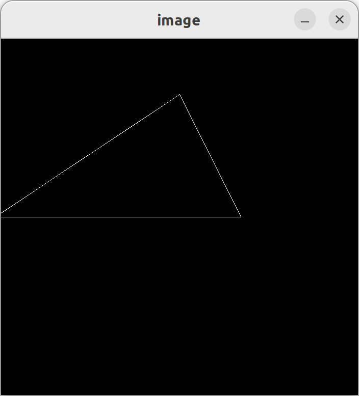
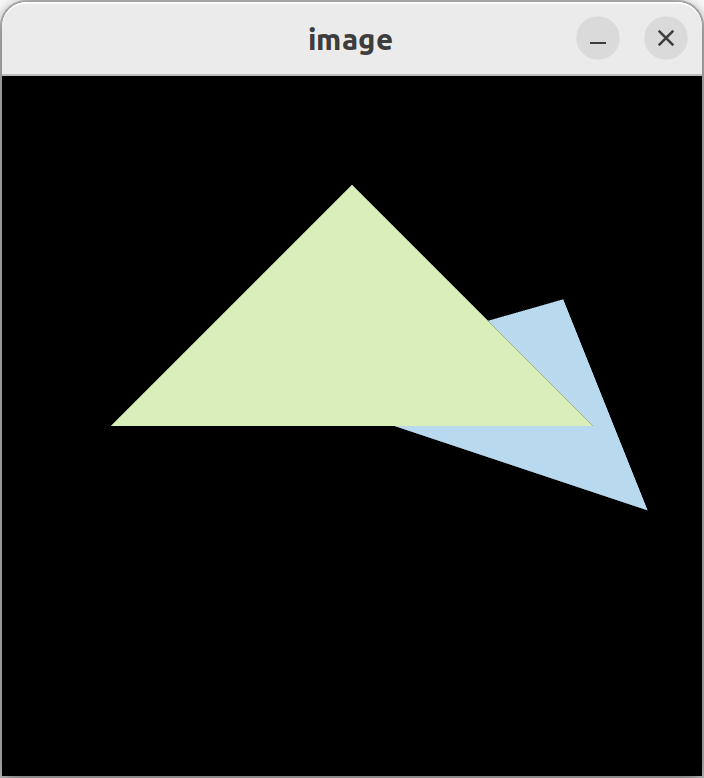
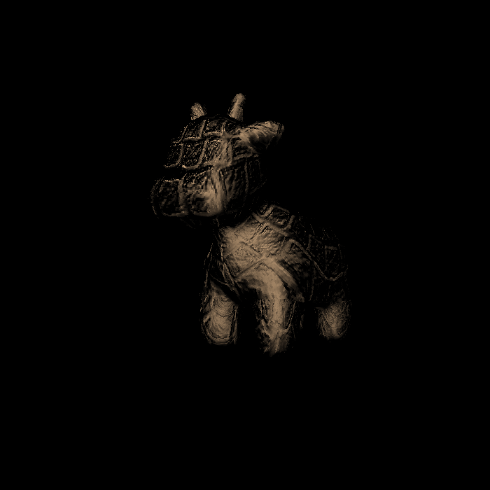
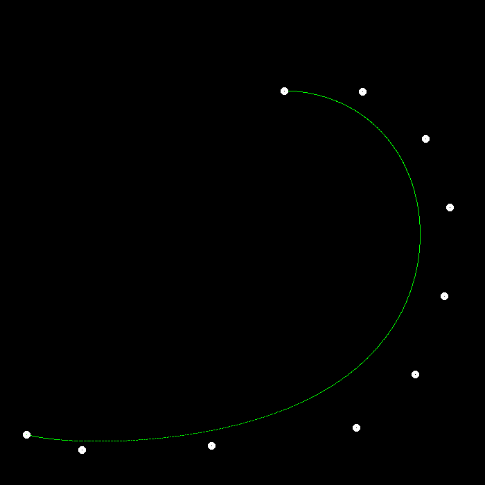

# Games 101 Assignments
课程主页：https://sites.cs.ucsb.edu/~lingqi/teaching/games101.html
课程视频（Bilibili）：https://www.bilibili.com/video/BV1X7411F744/
课程作业发布页面：http://games-cn.org/forums/topic/allhw/

本项目包含每一次作业的主要代码文件，不相关的内容已经略去。
作业的Bonus部分并未全部完成。
目前缺乏注释，之后可能会进行补充和完善。

### 结果展示
Assignment1 光栅化：

Assignment2 光栅化2：

Assignment3 BlingPhong：

Assignment4 贝塞尔曲线：

Assignment5 Whitted-Stlye光线追踪：

Assignment6 光线追踪加速结构：

Assignment7 光线追踪加速结构2：

